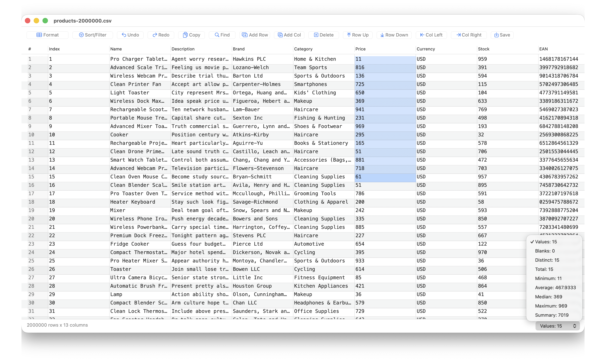

# Editable

Editable is a fast native macOS CSV editor built in Rust. It is designed to
solve one of the stubborn hurdles of working with CSV files on Mac computers:
opening, editing, and saving very large files without waiting on a spreadsheet
suite to catch up.



## Why Editable

CSV files are simple, but large CSV files can become painful in traditional Mac
spreadsheet apps. Editable keeps the experience focused on the table itself and
uses lightning-speed Rust code for parsing, indexing, editing, filtering,
sorting, and saving.

In tests conducted on an M2 MacBook Air with 8 GB RAM, Editable was able to
open, edit, and save 2+ GB CSV files in less than 10 seconds. That makes it a
major improvement over workflows that rely on Apple's Numbers app or Microsoft
Excel for large CSV editing.

## Features

- Open and edit CSV files in a native macOS table interface.
- Save changes back to CSV with correct quoting and delimiter handling.
- Find values quickly across the table.
- Sort and filter rows, including custom filter rules.
- Recognize numeric values for better comparisons and analysis.
- Show cell and selection analytics such as values, blanks, distinct values,
  minimum, average, median, maximum, and total.
- Add, delete, move, and edit rows and columns.
- Toggle header-row handling and skip leading rows before loading table data.
- Detect common CSV dialects and delimiters.

## Built For Large CSV Files

Editable's core CSV engine uses memory-mapped file access, compact row indexes,
edit overlays, and Rust data structures to avoid treating every edit like a full
spreadsheet recalculation. The result is a focused CSV editor that feels at home
with files that are too large or too slow for general-purpose office apps.

## Build From Source

Requirements:

- macOS 13 or newer.
- Apple Command Line Tools or Xcode.
- Rust stable, installed through `rustup`.

Build the release binary:

```bash
cargo build --release -p editable
```

Run the app from source:

```bash
cargo run -p editable
```

Run the app with a CSV file:

```bash
cargo run -p editable -- /path/to/file.csv
```

Build the bundled macOS app:

```bash
./scripts/build-app.sh
```

The bundled app is written to:

```text
dist/Editable.app
```

More detailed build notes are available in [BUILDING.md](./BUILDING.md).

## Feedback

Editable is built to make large CSV editing on macOS faster and calmer. Feedback,
bug reports, performance notes, and feature ideas are welcome by email at
[acolgecen@pm.me](mailto:acolgecen@pm.me).

## License

This project is licensed under the GNU General Public License v3. See [LICENSE](./LICENSE).
